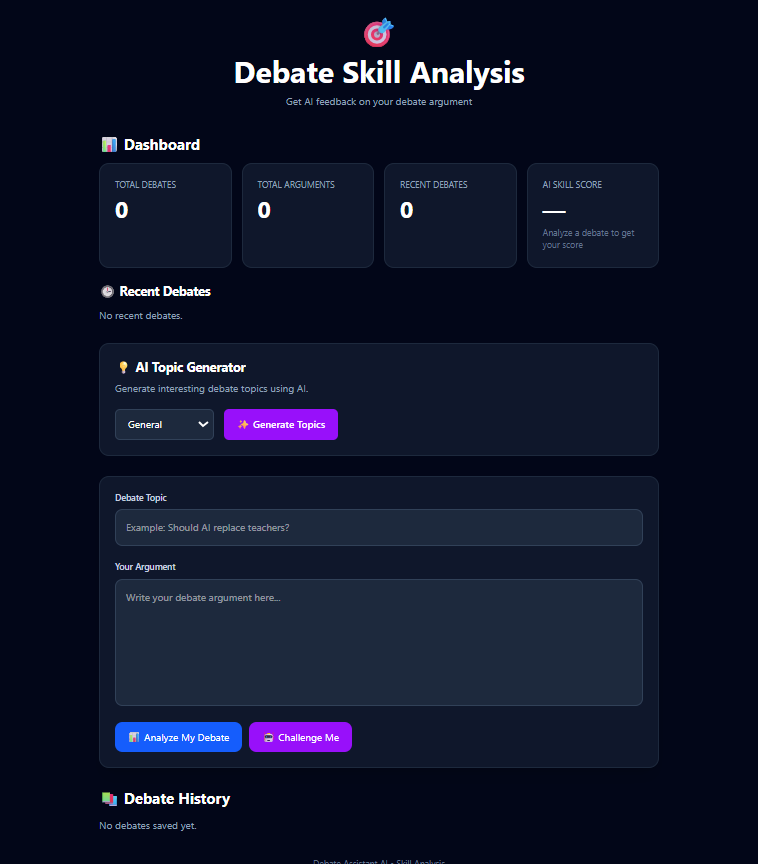

# Debate Assistant AI 🎯

<div align="center">



### **Empowering Next-Gen Debaters with Local AI & Intelligent Coaching**

An intelligent, full-stack AI-powered debate platform designed to sharpen critical thinking, generate structured multi-perspective arguments, challenge an interactive AI opponent, and provide rigorous 3-dimensional skill coaching with real-time scoring.

[](https://www.python.org/)
[](https://fastapi.tiangolo.com/)
[](https://react.dev/)
[](https://vitejs.dev/)
[](https://tailwindcss.com/)
[-000000?style=for-the-badge&logo=ollama&logoColor=white)](https://ollama.com/)
[](https://www.mongodb.com/)
[](LICENSE)

[Features](#-key-features) • [Architecture](#%EF%B8%8F-system-architecture--workflow) • [Developer Profile](#-developer-profile) • [Quick Start](#-quick-start-guide) • [API Reference](#-api-endpoints-reference) • [Tech Stack](#%EF%B8%8F-tech-stack)

</div>

---

## 👨‍💻 Developer Profile

<div align="center">
  

  ### **Mukesh Yadav**
  **Lead AI Systems Architect & Full-Stack Engineer**  
  *Lucknow, Uttar Pradesh, India*

  [](https://github.com/MukeshYadav0143)
  [](https://github.com/MukeshYadav0143/Debate-Assistant-AI)

</div>

| Attribute | Details |
| :--- | :--- |
| **Developer Name** | **Mukesh Yadav** |
| **Academic Institution** | **Babu Banarasi Das University (BBDU)**, Lucknow, India |
| **Degree & Program** | **Bachelor of Computer Applications (BCA)** |
| **Specialization** | **Data Science & Artificial Intelligence** |
| **Academic Standing** | *2nd Year (Batch 2024–2027)* |
| **Core Technical Focus** | Local LLM Orchestration, Prompt Engineering, Full-Stack Development, Data Analytics |
| **Primary Arsenal** | Python 3, FastAPI, React 19, Vite, Tailwind CSS v4, Ollama, Llama 3.2, MongoDB |
| **Role in Project** | End-to-end Architecture, Prompt Design, Backend API, Frontend UX, Scoring Algorithm |

---

## 💡 Project Motivation & Vision

In competitive debate and critical discourse, individuals often struggle with:
1. **Echo Chambers & Confirmation Bias**: Developing arguments from only one perspective.
2. **Access to Sparring Partners**: Finding articulate debate opponents available on demand.
3. **Objective Feedback**: Receiving actionable, un-biased coaching on logical consistency, clarity, and structural strength.
4. **Cloud Privacy & Cost**: Relying on expensive proprietary cloud LLMs that compromise user privacy.

**Debate Assistant AI** solves this by delivering an **offline-first, zero-cost, private debate coach and opponent** powered by Meta's **Llama 3.2 (3B)** running locally on your hardware via **Ollama**, backed by a resilient **FastAPI** backend and a reactive **React 19** dashboard.

---

## 🚀 Key Features

### 1. 💡 Dynamic AI Topic Generator
- Synthesizes 5 balanced, high-impact debate motions on demand.
- Supports six distinct domains: **Technology**, **Education**, **Environment**, **Social Media**, **Science**, and **General**.
- Features an automated regex JSON sanitization pipeline with deterministic fallbacks to guarantee valid UI rendering even if LLM output includes markdown formatting.

### 2. 🤖 Multi-Perspective Argument Synthesizer
- Instantly constructs balanced **PRO (FOR)** and **CON (AGAINST)** arguments for any motion.
- Generates structured premises with concrete real-world evidence and rhetorical reasoning.
- Provides debate strategy preparation summaries for competitive rounds.

### 3. ⚔️ Interactive AI Debate Opponent Arena
- Functions as an articulate, respectful AI sparring partner.
- Deeply inspects the user's argument and formulates:
  - A logically rigorous **Counterargument**.
  - Solid **Supporting Reasoning**.
  - A probing, thought-provoking **Follow-Up Question** to challenge weak points.

### 4. 📊 3-Dimensional Debate Coaching & Scoring
- Evaluates submitted user viewpoints across 3 fundamental debate criteria:
  - **Argument Strength** (Score / 10): Weight of evidence, persuasiveness, and logical foundation.
  - **Clarity** (Score / 10): Articulation, structure, conciseness, and tone.
  - **Reasoning & Logic** (Score / 10): Fallacy prevention, deduction, and coherence.
- Computes an **Overall Skill Score** (/ 10) with celebration confetti triggers for high scores ($\ge 6/10$).
- Outlines specific **Weaknesses** and actionable **Improvement Suggestions**.

### 5. 📈 Real-Time Interactive Analytics Dashboard
- Live dashboard metrics powered by MongoDB:
  - **Total Debates**: Comprehensive count of debate rounds logged.
  - **Arguments Analyzed**: Total user viewpoints coached.
  - **Recent Debates**: Rapid-access audit of latest debate rounds.
  - **AI Skill Score**: Dynamically parsed badge showing the user's latest coaching grade.

### 6. 💾 Persistent Debate Vault
- Automatically persists user debates, topics, viewpoints, and evaluation rounds to a local **MongoDB** collection.
- Allows retrospective review of past arguments to trace debater improvement over time.

### 7. 👨‍💻 Integrated Developer Profile & Modal
- Dedicated interactive developer profile card directly on the main interface.
- Includes a smooth backdrop-blur modal detailing Mukesh Yadav's background, education at BBD University, technical arsenal, project role, and GitHub channels.

---

## 🏗️ System Architecture & Workflow

The platform follows a decoupled, modular **3-Tier Client-Server Architecture**:

```
┌─────────────────────────────────────────────────────────────────────────┐
│                        PRESENTATION LAYER (Frontend)                    │
│                 React 19 • Vite • Tailwind CSS v4 • Lucide              │
│                                                                         │
│  ┌──────────────────┐  ┌──────────────────┐  ┌───────────────────────┐  │
│  │  Live Analytics  │  │ Dynamic Motions  │  │ Pro / Con Arguments   │  │
│  │    Dashboard     │  │    Generator     │  │      Synthesizer      │  │
│  └──────────────────┘  └──────────────────┘  └───────────────────────┘  │
│  ┌──────────────────┐  ┌──────────────────┐  ┌───────────────────────┐  │
│  │ AI Debate Arena  │  │ 3D Skill Scoring │  │   Developer Profile   │  │
│  │ (Opponent Spar)  │  │  & Visual Coach  │  │      & Modal Hub      │  │
│  └──────────────────┘  └──────────────────┘  └───────────────────────┘  │
└────────────────────────────────────┬────────────────────────────────────┘
                                     │ JSON over HTTP REST APIs
                                     ▼
┌─────────────────────────────────────────────────────────────────────────┐
│                        APPLICATION LAYER (Backend)                      │
│                  FastAPI • Python 3.13+ • Uvicorn • Pydantic            │
│                                                                         │
│  - CORS Middleware & Request Validation                                 │
│  - Prompt Orchestration & Cognitive Persona Engineering                 │
│  - Robust JSON Sanitization & Markdown Stripping Engine                 │
│  - Dual-Model Inference Strategy (Ollama Default ⇄ OpenAI Fallback)     │
│  - MongoDB Asynchronous / Resilient Connection Manager                  │
└──────────────────────────┬───────────────────────────────┬──────────────┘
                           │                               │
        Ollama HTTP Native │                               │ PyMongo Driver
             (Port: 11434) │                               │ (Port: 27017)
                           ▼                               ▼
┌─────────────────────────────────────┐ ┌─────────────────────────────────┐
│       AI INFERENCE ENGINE LAYER     │ │        PERSISTENCE LAYER        │
│        Ollama + Llama 3.2 (3B)      │ │        MongoDB Database         │
│  - Zero API Cost, 100% On-Device    │ │  - Collection: `debates`        │
│  - Low Latency & High Privacy       │ │  - User Sessions & Arguments    │
│  - Optional OpenAI GPT-4o-mini Fall │ │  - Dynamic Dashboard Aggregation│
└─────────────────────────────────────┘ └─────────────────────────────────┘
```

### Architectural Highlights
1. **Decoupled Client-Server Protocol**: Frontend and backend are completely decoupled. The frontend uses `VITE_API_BASE_URL` to route requests, making deployment to Docker, AWS, or Vercel seamless.
2. **Local AI Inference Engine**: Uses **Ollama** running **Meta Llama 3.2 (3B)** for private, offline inference with zero token charges.
3. **Resilient JSON Cleaning Pipeline**: The backend employs a regular-expression extraction engine (`clean_and_parse_json`) to safely strip markdown code blocks (````json ... ````) and extract clean JSON structures from the LLM.
4. **Resilient Database Connector**: Automatically handles MongoDB connection timeouts gracefully to ensure zero backend crashes even if the database is starting up.

---

## 🛠️ Tech Stack

| Layer | Technology | Purpose |
| :--- | :--- | :--- |
| **Frontend Framework** | **React 19** | Declarative, component-based user interface |
| **Build Tool** | **Vite 8.2** | Lightning-fast HMR and optimized production bundle |
| **Styling & Design** | **Tailwind CSS v4** | Modern utility-first styling with custom keyframe glow animations |
| **Icons & UI FX** | **Lucide React & Canvas-Confetti** | Clean SVG icons and milestone celebration particle animations |
| **Backend Framework** | **FastAPI** | High-performance, asynchronous Python web API framework |
| **Web Server** | **Uvicorn** | ASGI server for asynchronous request handling |
| **Data Validation** | **Pydantic** | Strict schema validation and typed JSON payloads |
| **AI / Inference** | **Ollama (Llama 3.2: 3B)** | High-speed local on-device LLM execution |
| **Cloud AI Fallback** | **OpenAI API (GPT-4o-mini)** | Optional cloud fallback via environment variables |
| **Database** | **MongoDB (PyMongo)** | Document-oriented storage for debate history vault |
| **Environment Config** | **python-dotenv** | Secure management of ports, hosts, and API credentials |

---

## 📂 Project Directory Structure

```text
Debate-Assistant-AI/
├── backend/
│   ├── .env                       # Backend configuration (ports, models, DB URI)
│   ├── .venv/                     # Python 3.13 virtual environment
│   ├── main.py                    # FastAPI application, prompt templates & endpoints
│   └── requirements.txt           # Python dependencies
├── frontend/
│   ├── public/
│   │   ├── developer.jpg          # High-resolution developer photograph
│   │   ├── favicon.svg            # Custom application favicon
│   │   └── icons.svg              # Vector iconography
│   ├── src/
│   │   ├── assets/
│   │   │   ├── developer.jpg      # Bundled developer photo
│   │   │   └── hero.png           # Hero illustration
│   │   ├── App.css                # Custom CSS enhancements
│   │   ├── App.jsx                # Core React application & interactive modal
│   │   ├── index.css              # Tailwind CSS v4 directives & keyframe animations
│   │   └── main.jsx               # React DOM root mounting entrypoint
│   ├── index.html                 # Single page application HTML root
│   ├── package.json               # Node.js scripts and frontend dependencies
│   └── vite.config.js             # Vite configuration with React and Tailwind plugins
├── screenshots/
│   ├── dashboard.png              # UI preview screenshot
│   └── developer.jpg              # Developer showcase photo
├── .gitignore                     # Git ignore rules for node_modules, .venv, etc.
└── README.md                      # Comprehensive project documentation
```

---

## ⚡ Quick Start Guide

Follow these steps to run **Debate Assistant AI** locally on your machine.

### Prerequisites

Ensure you have installed:
- [Python 3.10+](https://www.python.org/)
- [Node.js 18+](https://nodejs.org/) & `npm`
- [Ollama](https://ollama.com/)
- [MongoDB Community Server](https://www.mongodb.com/try/download/community)

---

### Step 1: Clone the Repository

```bash
git clone https://github.com/MukeshYadav0143/Debate-Assistant-AI.git
cd Debate-Assistant-AI
```

---

### Step 2: Start Local AI Model with Ollama

1. Launch Ollama in your terminal:
   ```bash
   ollama serve
   ```
2. Pull the optimized **Llama 3.2 (3B)** model (requires ~2.0 GB):
   ```bash
   ollama pull llama3.2:3b
   ```

---

### Step 3: Configure and Start the Backend

1. Navigate to the `backend/` directory:
   ```bash
   cd backend
   ```
2. Create and activate a Python virtual environment:
   ```bash
   # Windows PowerShell:
   python -m venv .venv
   .\.venv\Scripts\Activate.ps1

   # Linux / macOS:
   # python3 -m venv .venv
   # source .venv/bin/activate
   ```
3. Install dependencies:
   ```bash
   pip install -r requirements.txt
   ```
4. Verify or create `.env` in `backend/.env`:
   ```env
   OLLAMA_BASE_URL=http://localhost:11434
   OLLAMA_MODEL=llama3.2:3b
   MONGO_URI=mongodb://localhost:27017/
   # Optional: OPENAI_API_KEY=your_key_here
   ```
5. Run the FastAPI development server:
   ```bash
   uvicorn main:app --reload --port 8000
   ```
   * The backend will be live at `http://127.0.0.1:8000`
   * Interactive Swagger documentation: `http://127.0.0.1:8000/docs`

---

### Step 4: Configure and Start the Frontend

1. Open a new terminal and navigate to `frontend/`:
   ```bash
   cd frontend
   ```
2. Install npm dependencies:
   ```bash
   npm install
   ```
3. Start the Vite development server:
   ```bash
   npm run dev
   ```
4. Open your browser and navigate to:
   ```
   http://localhost:5173/
   ```

---

## 📡 API Endpoints Reference

The FastAPI backend exposes the following clean, typed REST endpoints:

### 1. Health Check
- **Endpoint**: `GET /health`
- **Description**: Verifies backend server health.
- **Response**:
  ```json
  {
    "status": "OK"
  }
  ```

---

### 2. Generate Debate Topics
- **Endpoint**: `POST /generate-topic`
- **Description**: Synthesizes 5 debate motions for a chosen category.
- **Request Body**:
  ```json
  {
    "category": "Technology"
  }
  ```
- **Response**:
  ```json
  {
    "category": "Technology",
    "topics": [
      "Should AI algorithms be legally accountable for algorithmic bias?",
      "Will quantum computing render modern cryptography obsolete?",
      "Should social media algorithms prioritize educational over engagement content?",
      "Is open-source AI safer for humanity than proprietary models?",
      "Should brain-computer interfaces be restricted to medical use only?"
    ]
  }
  ```

---

### 3. Generate Pro / Con Arguments
- **Endpoint**: `POST /generate-arguments`
- **Description**: Constructs balanced, structured PRO and CON arguments with evidence.
- **Request Body**:
  ```json
  {
    "topic": "Should AI replace teachers in classrooms?",
    "category": "Education"
  }
  ```
- **Response**:
  ```json
  {
    "topic": "Should AI replace teachers in classrooms?",
    "category": "Education",
    "ai_response": "### PRO (FOR)\n* Personalized pacing tailored to each student...\n\n### CON (AGAINST)\n* Lack of emotional intelligence and mentorship..."
  }
  ```

---

### 4. Interactive Debate Opponent
- **Endpoint**: `POST /debate-opponent`
- **Description**: Analyzes user reasoning and delivers an articulate counterargument with a question.
- **Request Body**:
  ```json
  {
    "topic": "Are electric vehicles truly zero-emission?",
    "argument": "Electric vehicles have zero tailpipe emissions and significantly reduce urban air pollution."
  }
  ```
- **Response**:
  ```json
  {
    "topic": "Are electric vehicles truly zero-emission?",
    "user_argument": "Electric vehicles have zero tailpipe emissions...",
    "opponent_response": "While tailpipe emissions are zero, battery lifecycle manufacturing and fossil-powered electrical grids generate substantial upstream emissions.\n\nSupporting Reason: Lifecycle assessment studies demonstrate high initial carbon debt.\n\nQuestion: How should we address the environmental impact of raw lithium extraction in developing countries?"
  }
  ```

---

### 5. Debate Skill Coaching & Score Analysis
- **Endpoint**: `POST /analyze-debate`
- **Description**: Performs 3D evaluation across Argument Strength, Clarity, and Reasoning.
- **Request Body**:
  ```json
  {
    "topic": "Should space exploration receive public funding?",
    "argument": "Space research drives breakthrough technologies like GPS, satellite communications, and water filtration that benefit all humanity."
  }
  ```
- **Response**:
  ```json
  {
    "topic": "Should space exploration receive public funding?",
    "argument": "Space research drives breakthrough technologies...",
    "analysis": "Argument Strength: 8.5/10\nClarity: 9/10\nReasoning: 8/10\n\nWeaknesses: Could cite specific return-on-investment figures per tax dollar spent.\n\nImprovement Suggestions: Quantify how satellite telemetry aids climate disaster relief.\n\nOverall Score: 8.5/10"
  }
  ```

---

### 6. Save Debate Session
- **Endpoint**: `POST /save-debate`
- **Description**: Stores debate topic and argument into the MongoDB vault.
- **Request Body**:
  ```json
  {
    "topic": "Remote work increases productivity",
    "argument": "Employees save hours on daily commutes, reducing burnout."
  }
  ```
- **Response**:
  ```json
  {
    "message": "Debate saved successfully!",
    "id": "66432b85e05ab64218f2d59a"
  }
  ```

---

### 7. Retrieve Debate Vault History
- **Endpoint**: `GET /debates`
- **Description**: Returns all historical debates saved in the MongoDB collection.
- **Response**:
  ```json
  {
    "debates": [
      {
        "_id": "66432b85e05ab64218f2d59a",
        "topic": "Remote work increases productivity",
        "argument": "Employees save hours on daily commutes, reducing burnout."
      }
    ]
  }
  ```

---

## ⚙️ Environment Configuration

### Backend (`backend/.env`)
| Variable | Default Value | Description |
| :--- | :--- | :--- |
| `OLLAMA_BASE_URL` | `http://localhost:11434` | Endpoint for the local Ollama daemon |
| `OLLAMA_MODEL` | `llama3.2:3b` | Target local LLM model tag |
| `MONGO_URI` | `mongodb://localhost:27017/` | Connection string for MongoDB |
| `OPENAI_API_KEY` | *(Empty)* | Optional key for cloud fallback |
| `OPENAI_MODEL` | `gpt-4o-mini` | Fallback OpenAI model name |

### Frontend (`frontend/.env`)
| Variable | Default Value | Description |
| :--- | :--- | :--- |
| `VITE_API_BASE_URL` | `http://localhost:8000` | Base URL of the FastAPI backend service |

---

## 📈 Engineering Highlights & Design Decisions

1. **Why Ollama + Llama 3.2 (3B)?**
   - Llama 3.2 (3B) provides an ideal balance of conversational depth, logical deduction, and low memory footprint (~2.0 GB VRAM/RAM).
   - Running locally guarantees zero recurring API costs and preserves 100% user privacy.

2. **Regex-Based LLM Sanitization Pipeline**:
   - Small models often prepend or append markdown fences (````json ... ````) despite strict system instructions. The backend's `clean_and_parse_json` utility strips outer fences and uses greedy regex extraction to recover valid JSON data reliably.

3. **Smooth Interactive UX with Tailwind v4 & Confetti**:
   - Modern glassmorphism UI styled in deep space hues (`#020617`).
   - Dynamic regex extraction parses the AI coach's numeric score to trigger joyful canvas confetti whenever a score reaches $6/10$ or higher.

---

## 🗺️ Roadmap & Future Enhancements

- [ ] **Voice Sparring Arena**: Real-time voice-to-text input and natural text-to-speech AI opponent voice.
- [ ] **Multi-Turn Debate Sessions**: Enable extended 5-round Oxford-style debates with continuous contextual memory.
- [ ] **Exportable PDF Performance Dossier**: Download official debate scorecard certificates with comprehensive breakdown charts.
- [ ] **Global Leaderboard**: Community peer debates and skill rating badges (Novice, Scholar, Grand Debater).

---

## 🤝 Contributing

Contributions, feedback, and feature suggestions are welcome!

1. Fork the Project repository.
2. Create your Feature Branch (`git checkout -b feature/AmazingFeature`).
3. Commit your Changes (`git commit -m 'Add some AmazingFeature'`).
4. Push to the Branch (`git push origin feature/AmazingFeature`).
5. Open a Pull Request.

---

## 📄 License

Distributed under the **MIT License**. See [`LICENSE`](LICENSE) for more information.

---

<div align="center">
  Crafted with ❤️ by <strong>Mukesh Yadav</strong><br />
  <em>Babu Banarasi Das University (BBDU) • BCA (Data Science & AI, 2nd Year)</em><br />
  <strong>Debate Assistant AI — Sharpening Critical Thinking for Everyone</strong>
</div>
